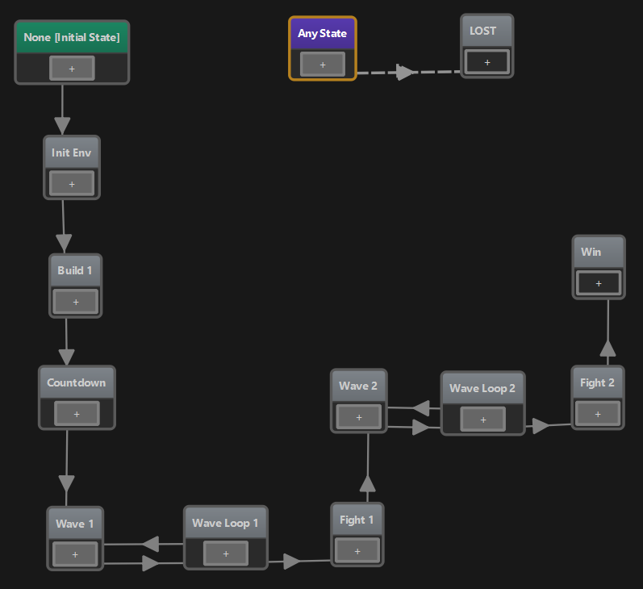
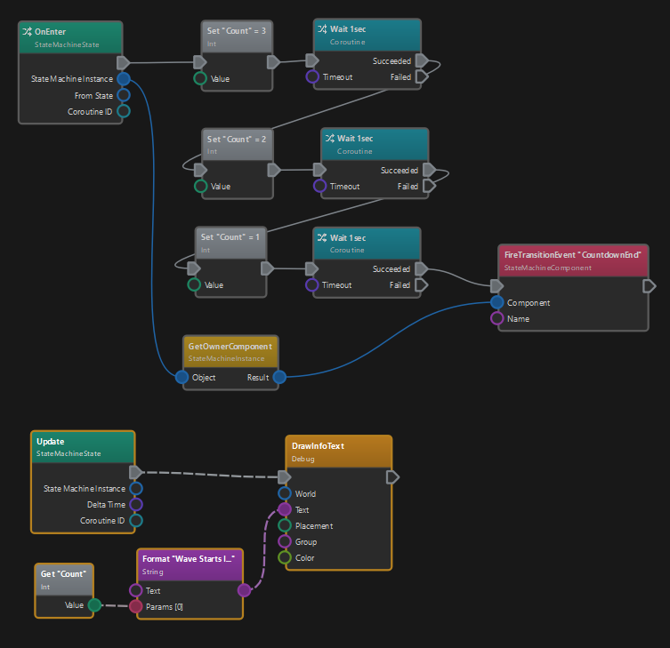

# MA Devlog 5 - Level Logic

Today I've looked into doing some of the level logic. Meaning when monsters are spawned, when you win or lose, and so on. I've also added that placing traps costs money and you only have a limited amount of money.

It's all working, but just so, and I'm not happy enough with it, that I think it already makes sense to dive deep into any of it. However, I can post some teasers at least. Here is the state machine for my test level:

Since the game is very linear in nature, working with state machines makes a lot of sense, and makes my life indeed much easier. I can create building blocks for the different phases, and if I ever build multiple levels, they can be easily re-used in different configurations.

For example here is the visual script that is used by the *Countdown* phase:

It's using the cool new *coroutine* feature to run a script across many frames. It literally just counts down a number from 3 to 1 and then ends. In parallel the *Update* hook makes sure to print that number to screen every frame. Quite neat.

## See Also

* [Monster Attack Sample](monster-attack.md)