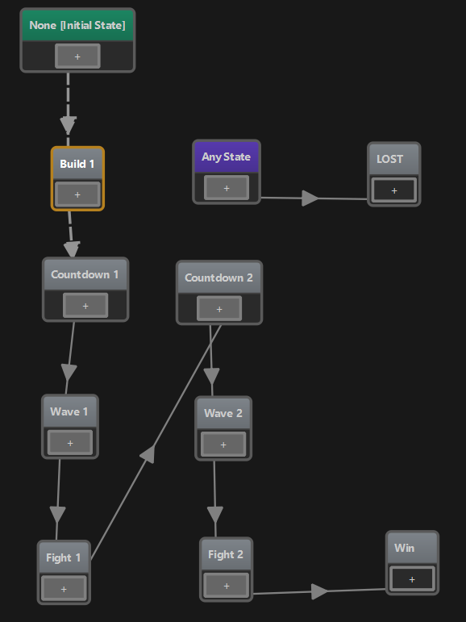
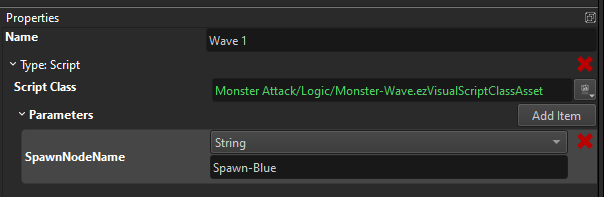
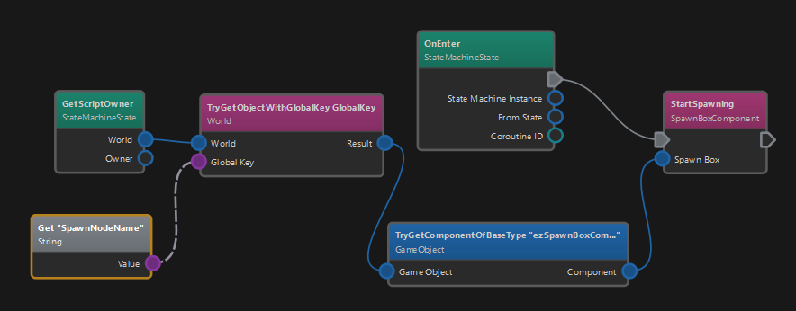
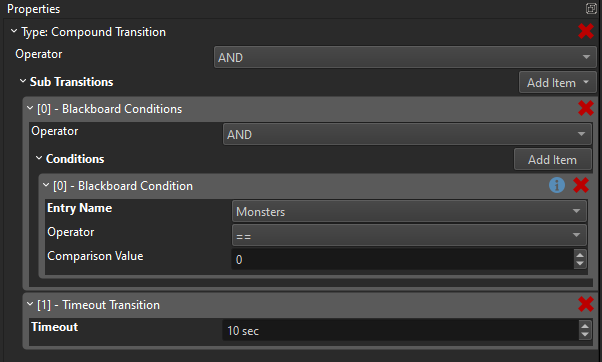
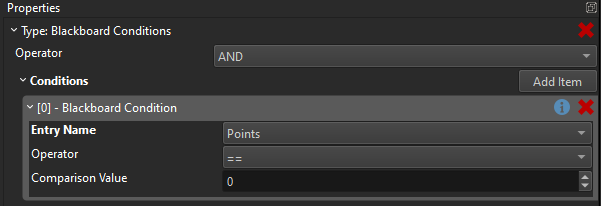
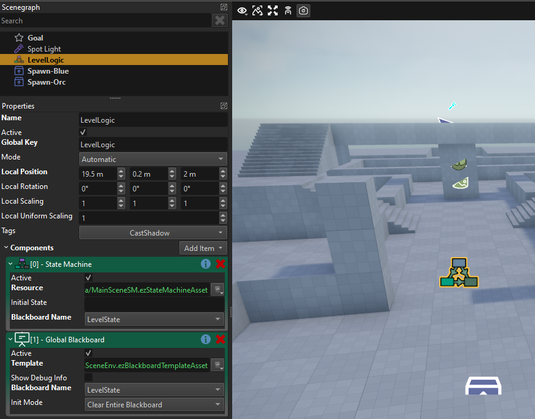

# MA Devlog 6 - More Level Logic

The last days I ran into expected problems. After having a prototype up an running, I found several bugs and encountered usability issues.

My main usability issue was with the global state handling. The game needs to track a few things (for example, how many monsters are currently alive). These values need to be initialized and reset properly every time I start a level. I do all development from inside the editor, so I restart the game frequently, and this needs to work reliably.

So one thing I did to make this easier, is to add the [Global Blackboard Component](https://github.com/ezEngine/ezEngine/pull/1065). All it does, is to initialize blackboard values for you at level start. Then all other scripts work as desired. Since global state is truly global, it would otherwise persist even across runs and across level transitions (which can be useful).

Another thing I needed, was to spawn many monsters in an area over a certain time, so that they disperse a bit. I've previously hacked this together using the [spawn component](../../docs/gameplay/spawn-component.md) but since this is a quite useful feature, I decided to write a proper [new component](https://github.com/ezEngine/ezEngine/pull/1070) for this.

So now I can do this:

<video src="media/devlog6/ma-dl6-SpawnBox.mp4" width=600 controls></video>

Of note here is that all our "gameplay" components are mostly meant as demonstrations how one could do some feature. If those components are sufficient for you, that's great, but for a lot of use cases they won't be perfect and you are encouraged to write your own. The great thing about open source is obviously, that you can look at how the built-in features are done for inspiration. So these components give you a decent starting point for doing copy & paste, or how I like to call it "CTRL+C, CTRL+Inspire" ;)

Another thing I've done, is to get my level state machine working properly. It currently looks like this:

This nicely visualizes the level logic. We start at the initial state, after that the player has unlimited time to build traps (but limited money). The game displays "Press 'G' to start". Once the player does so, a short countdown is displayed, then the first wave of monsters is spawned and the player has to fight. Once all monsters from that wave are dead, a second countdown is shown, the second wave of (different) enemies is spawned and finally when all are dead, the player wins.

State machines are made up of states and transitions between them. Only one state is active at any time. When a state is active, it may execute code. This can be C++ or *Visual Script* code.

For example the "Wave 1" state looks like this:

Here I've selected the *script* state type and given it my custom script. Additionally I can pass in parameters, so here I tell it which game object to use for spawning monsters. This way I can reuse the same script for different monster types.

The script isn't very spectacular:

All it does is find the desired game object via a [global key](../../docs/runtime/world/game-objects.md#global-keys), retrieves its spawn box component and tells it to start spawning.

The actual game logic is mostly implemented on the transitions. Every state may have multiple outgoing transitions to different states. If the condition of a transition is met, the state machine follows that transition and switches to another state. What transition types are available can be extended with C++, but the most common ones are the *timeout transition*, which just waits for a bit, and the *blackboard transition* which checks whether some values are as desired.

For example here is the *Fight -> Countdown* transition setup:

This uses a compound to combine multiple transition types. Here a timeout of 10 seconds is used to enforce a minimum delay. Additionally we wait for the `Monsters` value in the blackboard to reach the value 0. Once this is the case, the *Fight* phase is over and the next phase can begin.

Finally, you certainly noticed the *Any State*. This is a convenience feature, that allows you to basically add a transition from all states to another state, without having to set all that up manually. The *Any State* itself doesn't do anything, it is a placeholder. What you do configure, is the transition:

Here our simple logic just says, that if the `Points` blackboard value reaches zero, we transition into the *Lost* state. You lose points every time a monster arrives at the level end.

So how do we get all this running in our game? We just add a [State Machine](../../docs/custom-code/game-logic/state-machine-component.md) object into our scene:

Here I also gave the object the global key **LevelLogic**, so that my C++ custom [game state](../../docs/runtime/application/game-state.md) can also find it and send a message to it for the `G` input, but other than that it is self sufficient.

Well, that was a long post. If you managed to read this far, here is a [video of it all in action](https://1drv.ms/v/s!Ajrhg3sdAbZvltMpVgWHMQ76muk9xw?e=NNngvl).

## See Also

* [Monster Attack Sample](monster-attack.md)