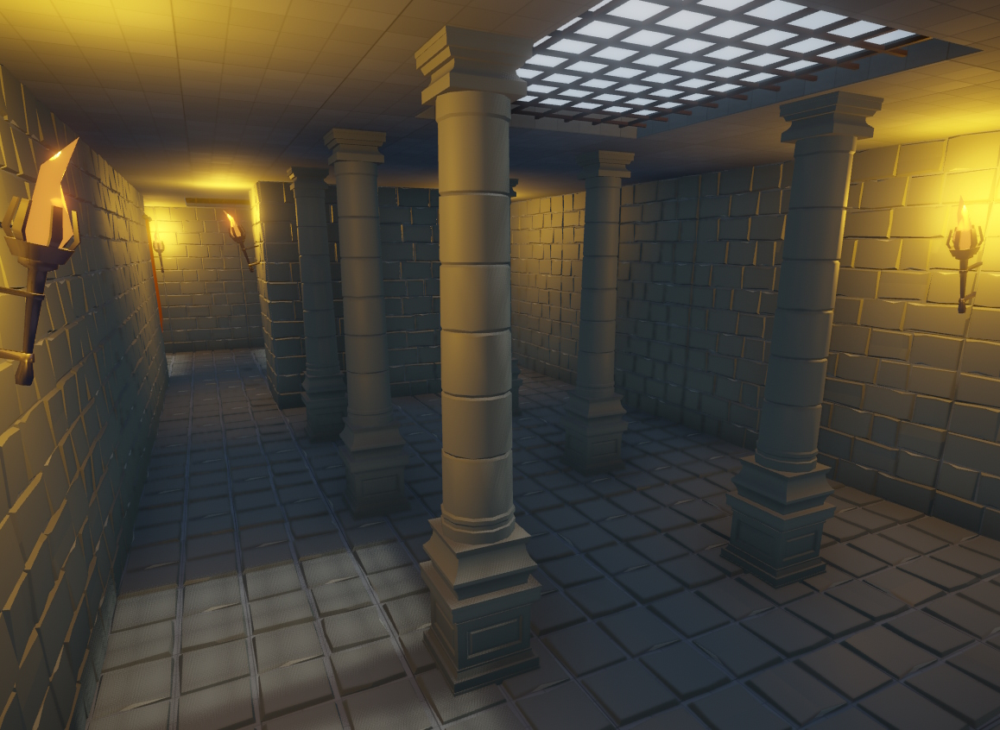
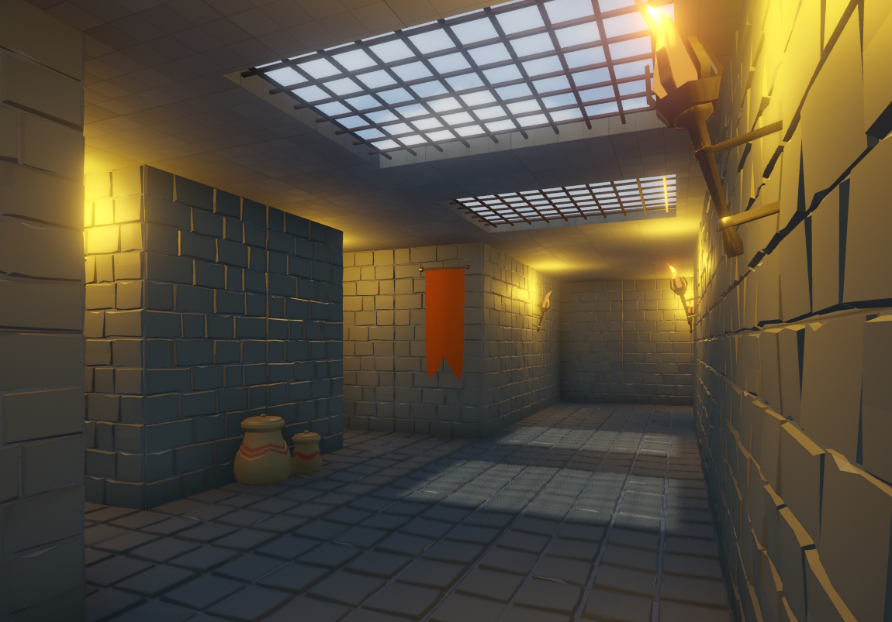
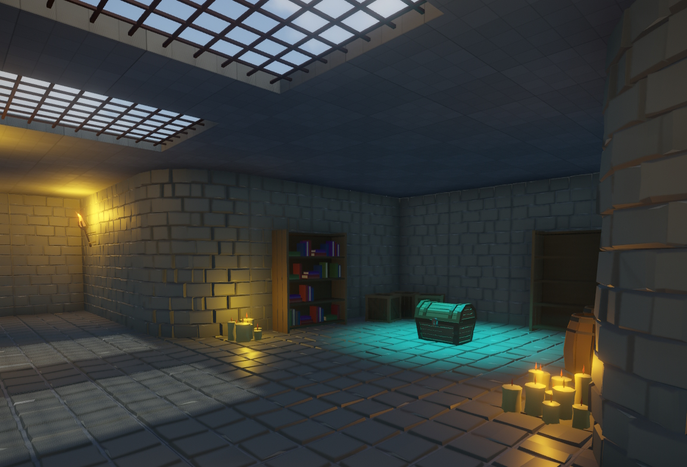
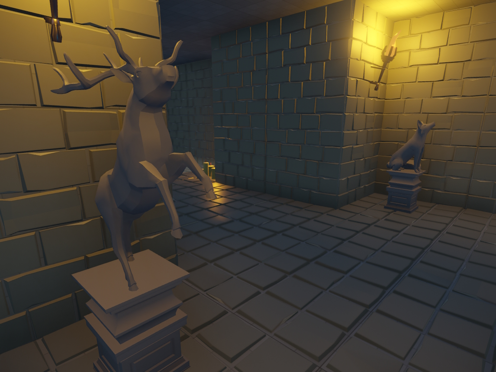
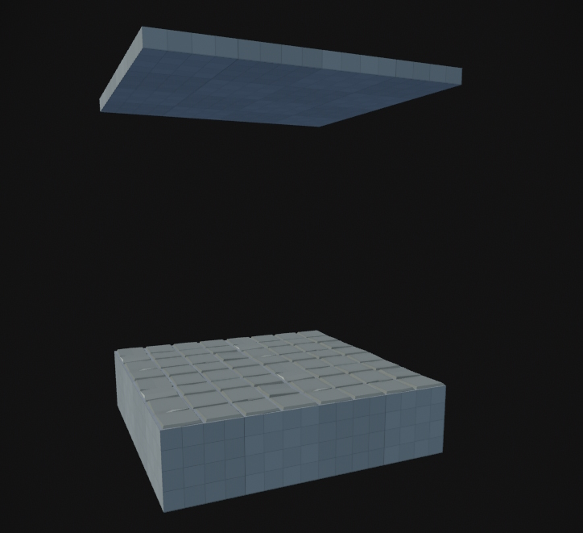
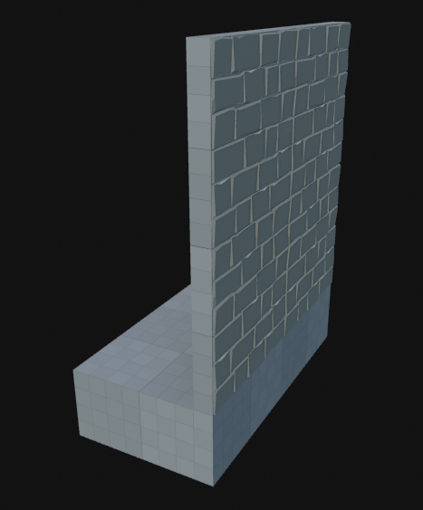
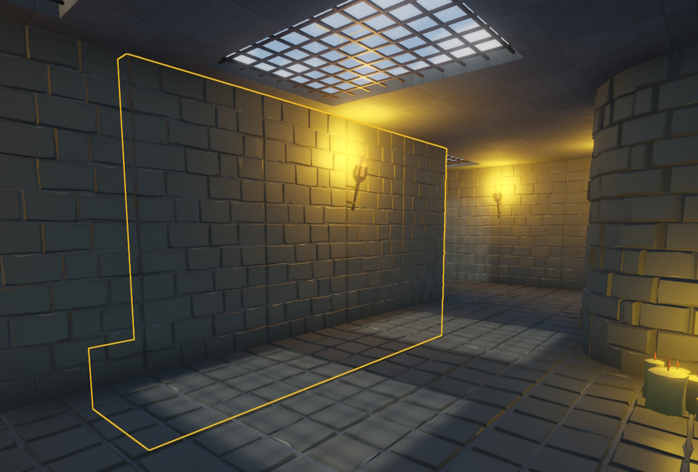
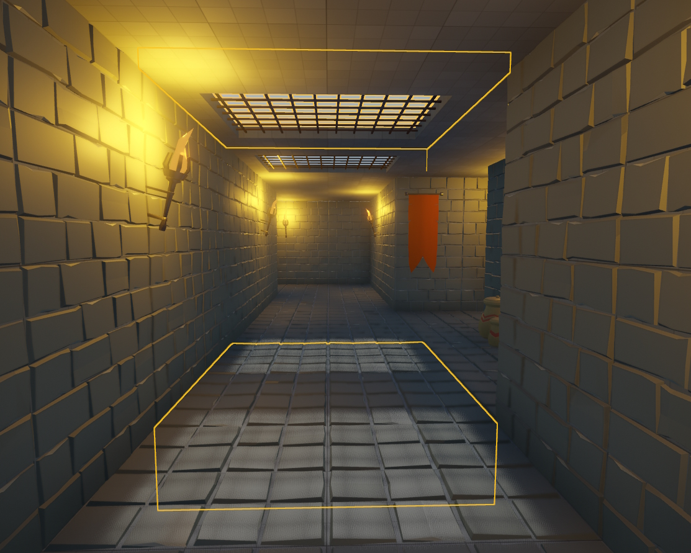
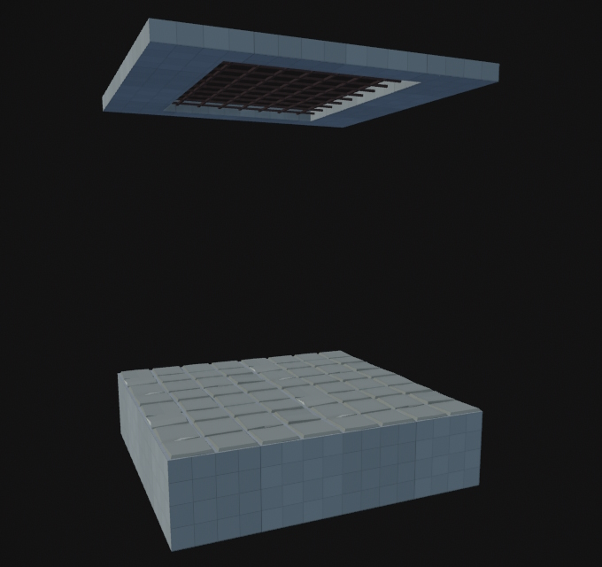
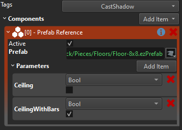

# MA Devlog 7 - Level Pieces

Yesterday I spent some time turning my greybox level into something actually presentable.

For this I used the great assets from [Quaternius](https://quaternius.com).

Here are a few screenshots of the results:

Since my gameplay is modular (traps can only be placed on a grid), my level design also needs to cater to this, and my workflow can benefit from it.

My first attempt was to place the modular assets as I thought they should fit. This didn't work out, though, and I needed to go for a more rigid approach. So my next attempt was to build modular prefabs that always take up either 2x2 meters or a multiple of that.

So a floor piece looks like this:

Now I needed some guidance on how to place walls. Would you place walls ON the floor plates? That's what I did in my first, failed attempt. So this time I made wall pieces take up their own tile and to make this very clear during placement, they contain their floor section as well:

Thus my level is made up of relatively large and easy to place pieces:

Once I had my level rebuilt with these pieces, I wanted some lighting and decoration. This becomes annoying pretty fast, especially when you want certain things to always look the same. For example the torches were all supposed to be in similar places (same height etc).

So I had the idea to just put some decoration elements directly into my wall prefabs and make them an optional switch. I used [exposed prefab parameters](../../docs/concepts/exposed-parameters.md) to achieve this. Basically, I just expose the *Active* property of some group object under a nice name.

For example for the floor prefab I added that it can optionally have a ceiling, and I added a second option to have a ceiling with a grate in it:

So now when I place this prefab, I get these options:

With these prefabs at hand, building my level was quite straight forward and it is relatively quickly modified.

It's always amazing, how a few nice assets turn something from "crappy proof of concept" into "looks like a proper game", even though it's still way closer to the former :D

## See Also

* [Monster Attack Sample](monster-attack.md)