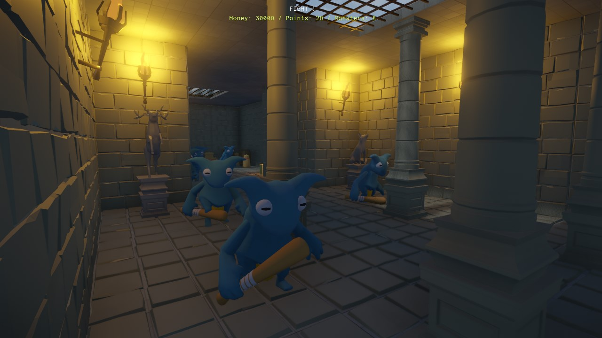

# Monster Attack Sample

*Monster Attack* (**MA**) is a tower-defense sample game inspired by the game [Orcs Must Die!](https://en.wikipedia.org/wiki/Orcs_Must_Die!).

The sample demonstrates the use of a wide range of features. Parts of its development are covered in a series of **Devlogs**.

The code and data are hosted in a separate GitHub repository.

Please see its main [Readme file](https://github.com/ezEngine/project-monster-attack) for up-to-date build instructions, game controls and other details.

## Video

Click the image below for a demo playthrough video:

## Devlogs

This sample is accompanied by a series of *Devlogs* (see sidebar on the left) which describe how to use various engine features to accomplish different game mechanics.

## See Also

* [Samples](../samples-overview.md)
* [Videos](../../getting-started/videos.md)