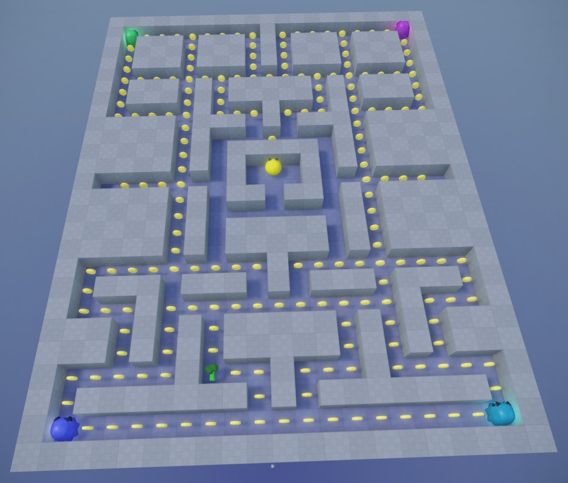

# PacMan Sample

This sample is a basic implementation of the classic *PacMan* game. It demonstrates various aspects of the engine, for example how to add custom code through the [C++ project generation](../docs/custom-code/cpp/cpp-project-generation.md).

## How to Run the Game

To run this sample, you have to first compile the code for it. Select to *Project > C++ Project > Compile Plugin*. Make sure the compilation step succeeded. If it fails, select *Project > C++ Project > Setup C++ Plugin...* and make sure the solution can be generated successfully, then open the solution and make sure it compiles correctly. 

Afterwards [run the scene](../docs/editor/run-scene.md). For the best experience, use the *Export and Run* mode (**Ctrl+R**).

## Video: Game Tutorial - PacMan

This tutorial video shows how to build a PacMan game from scratch. It walks you through the project setup and the fundamental steps to get the game logic working. To get a deeper insight into how to make a more fully functional game, have a look at the code of the sample project.

## Project

The editor project belonging to this sample can be found under *Data/Samples/PacMan*.

It contains a few assets taken from [Quaternius](https://quaternius.com) and [freesound.org](https://freesound.org).

## Code

The code uses a custom C++ plugin, generated using the [C++ project generation](../docs/custom-code/cpp/cpp-project-generation.md). It provides [custom components](../docs/custom-code/cpp/custom-cpp-component.md), and also utilizes a custom [game state](../docs/runtime/application/game-state.md) for the higher level logic.

It is advised to watch the tutorial video first, to get a grasp of the basics, and then study the code for details that aren't covered in the video. For example the project also shows:

* how to play sounds
* how to use a [blackboard](../docs/misc/blackboards.md) for tracking state
* how to reset a scene (by loading it from scratch)
* how to [draw some (debug) text](../docs/debugging/debug-rendering.md) to the screen

## See Also

* [Samples](samples-overview.md)
* [Videos](../getting-started/videos.md)
