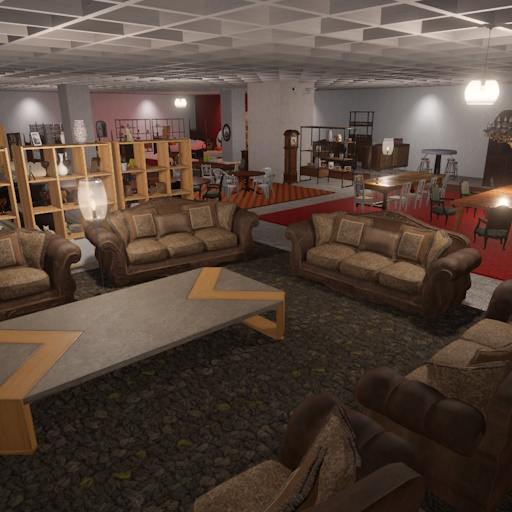

# Store Sample

The **Store Sample** demonstrates the use of a large number of high quality assets.

For more details, check out its [GitHub repository](https://github.com/ezEngine/store-sample).

The sample can be downloaded directly from the ezEditor [dashboard](../docs/editor/dashboard.md), though because of its size, the download may take a while.

## Video: Store Sample

## See Also

* [Samples](samples-overview.md)
* [Videos](../getting-started/videos.md)
